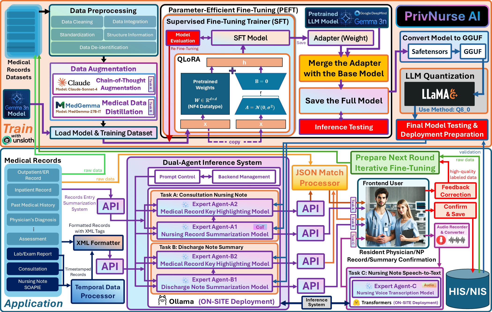
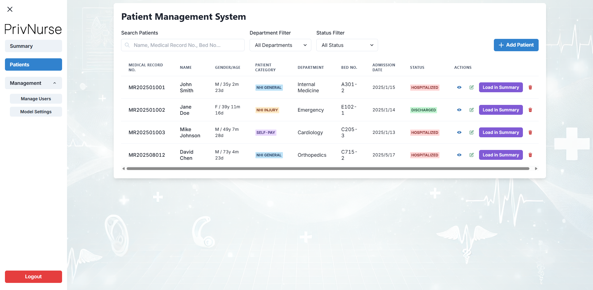
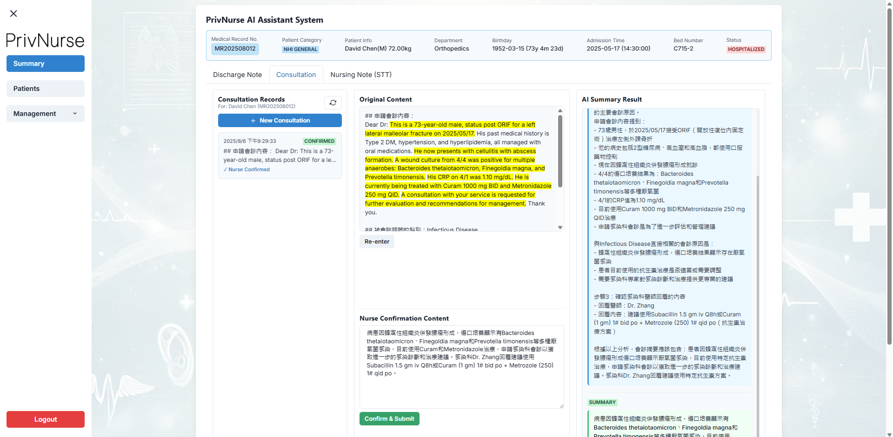
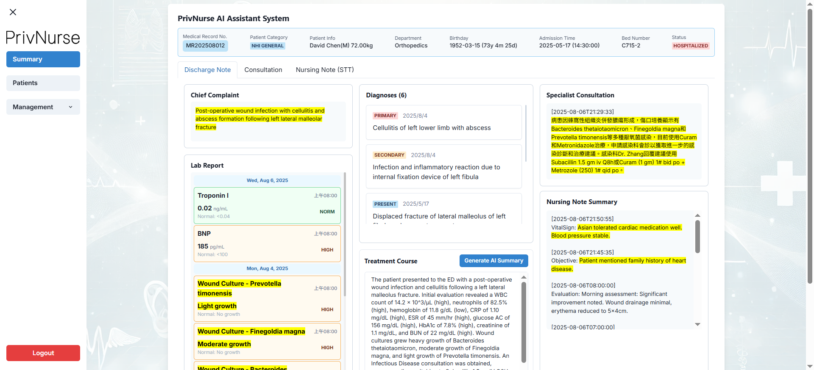
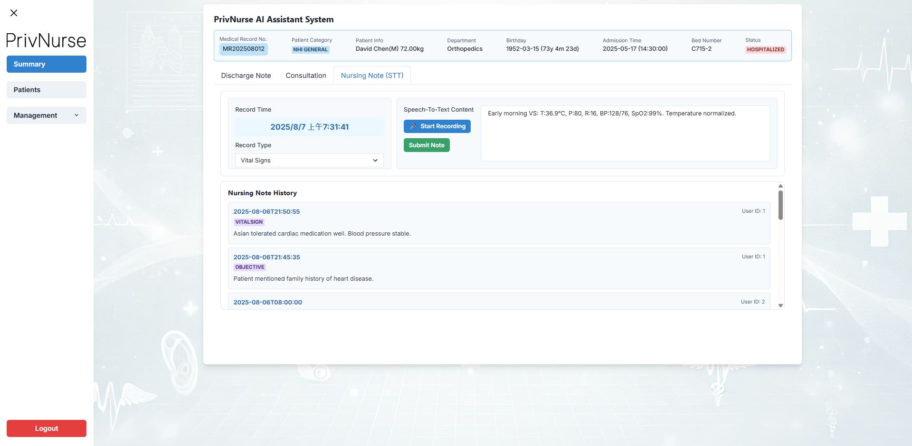
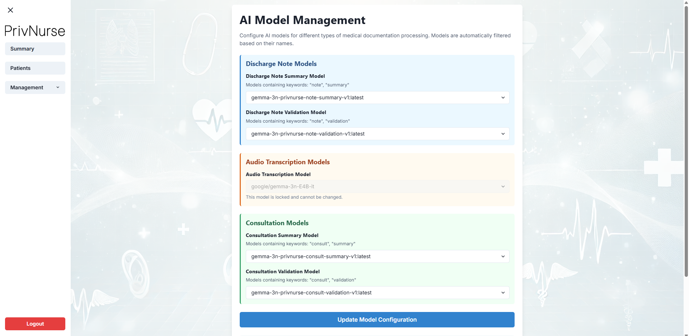
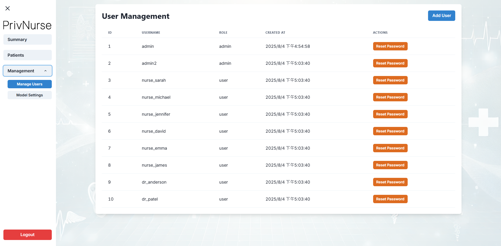
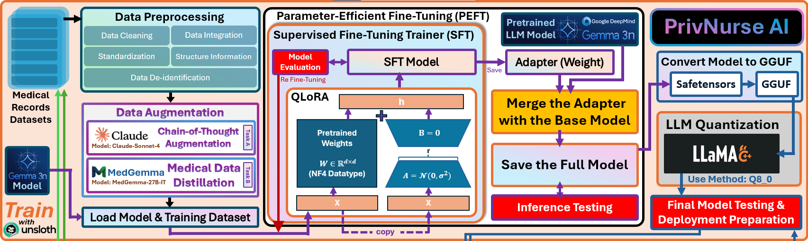
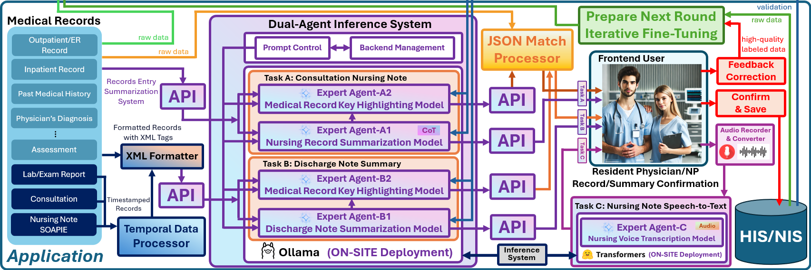

# PrivNurse AI: Revolutionizing Clinical Documentation with On-Device Intelligence

> **Empowering Healthcare Professionals with Secure, Offline-Ready AI that Transforms Medical Documentation While Keeping Patient Data Protected**

[](https://youtu.be/gfFrrqFYB-s?si=UwFKngUBT0wq_RlK)
[](https://github.com/weilin1205/PrivNurseAI/blob/main/PrivNurseAI_Technical_Report.pdf)
[](https://opensource.org/licenses/Apache-2.0)
[](https://www.python.org/downloads/)
[](https://fastapi.tiangolo.com/)
[](https://nextjs.org/)

**Authors:** Wei-Lin Wen, Yu-Yao Tsai

---

## 🚀 Executive Summary

<div align="center">
  
  <p><em>Figure 1: PrivNurse AI System Architecture Overview</em></p>
</div>

PrivNurse AI is an end-to-end, on-premises artificial intelligence system designed to combat one of the most pressing issues in modern healthcare: **clinician burnout driven by administrative overload**. By harnessing the unparalleled on-device efficiency and multimodal capabilities of Google's **Gemma 3n**, PrivNurse AI empowers nurses and physicians by automating and accelerating the creation of complex clinical documentation.

### 🎯 Core Features

The system features three core modules:

1. **🩺 Consultation Note Summarizer** - Uses Chain-of-Thought reasoning to discern clinical priorities
2. **📋 Discharge Note Summarizer** - Generates structured discharge summaries
3. **🎤 Speech-to-Text Nursing Note Transcriber** - Hands-free clinical documentation

Deployed entirely within a hospital's secure network, PrivNurse AI **guarantees patient data privacy** (HIPAA/GDPR compliance) while delivering clinically-validated, explainable, and continuously improving AI assistance, directly at the point of care.

### 📊 Clinical Results

Our one-month clinical deployment study at Kuang Tien General Hospital demonstrated exceptional results:

- **🏆 User Satisfaction**: 9.17/10 average rating
- **📈 Adoption Rate**: >85% (exceeding industry benchmarks of 60-75%)
- **⚡ Time Reduction**: 91.7% reduction in documentation time (from 5 minutes to 25 seconds per consultation note)
- **👥 Study Participants**: 39 nursing staff across 2 nursing stations
- **📝 Records Processed**: 401 consultation records

---

## 🎬 System Demonstration

### Patient Management System
<div align="center">
  
  <p><em>Comprehensive patient data management with intuitive interface</em></p>
</div>

### Consultation Note Summarization
<div align="center">
  
  <p><em>AI-powered consultation note summarization with explainable highlighting</em></p>
</div>

### Discharge Note Summarization
<div align="center">
  
  <p><em>Structured discharge summary generation from comprehensive medical records</em></p>
</div>

### Speech-to-Text Transcription
<div align="center">
  
  <p><em>Hands-free nursing documentation via advanced speech recognition</em></p>
</div>

### AI Model Management
<div align="center">
  
  <p><em>Centralized management of specialized clinical AI models</em></p>
</div>

### User Management
<div align="center">
  
  <p><em>Role-based access control for healthcare professionals</em></p>
</div>

---

## 🏗️ System Architecture

### Training Pipeline: Forging a Clinical Expert

<div align="center">
  
  <p><em>Figure 2: Advanced Training Pipeline Architecture</em></p>
</div>

Our comprehensive training pipeline transforms the general-purpose Gemma 3n into a highly specialized clinical expert through four critical stages:

#### **Stage 1: Data Preprocessing & De-identification**
- **Data Cleaning**: Removal of incomplete records and inconsistencies
- **Standardization**: Uniform formatting across different record types
- **Data Integration**: Consolidation of multi-source medical records
- **HIPAA Compliance**: Complete de-identification following Safe Harbor guidelines

#### **Stage 2: Intelligent Data Augmentation**
- **Medical Structured Chain-of-Thought (MedSCoT)**: Claude-Sonnet-4 generates reasoning chains for consultation prioritization
- **Medical Data Distillation**: MedGemma-27B-IT creates structured discharge summaries with 5 essential elements
- **Clinical Reasoning Integration**: Teaching models *how* to think, not just *what* to write

#### **Stage 3: Parameter-Efficient Fine-Tuning (PEFT)**
- **QLoRA Technique**: 4-bit quantization with Low-Rank Adaptation
- **Unsloth Optimization**: 1.5x faster training with 50% less VRAM usage
- **Four Specialized Models**: Dedicated agents for summarization and validation tasks

#### **Stage 4: Deployment Optimization**
- **Model Merging**: Integration of LoRA adapters with base Gemma-3n-E4B
- **GGUF Conversion**: Optimization for Ollama framework compatibility
- **Q8_0 Quantization**: 37.5% VRAM reduction (16GB → 10GB) without accuracy loss

### Application Pipeline: AI at the Clinician's Fingertips

<div align="center">
  
  <p><em>Figure 3: Real-time Clinical Application Architecture</em></p>
</div>

#### **Dual-Agent Inference System**
Our innovative architecture deploys four specialized models through the Ollama framework:

**Task A & B: Document Summarization**
- **Agent 1 (Summarizer)**: Generates clinical summaries using MedSCoT reasoning
- **Agent 2 (Highlighter)**: Identifies source evidence and provides explainability
- **JSON Match Processor**: Creates bidirectional traceability between summaries and source text

**Task C: Multimodal Speech Processing**
- **Gemma-3n Audio Processing**: FastAPI-based microservice for real-time transcription
- **Clinical Context Optimization**: Specialized prompts for medical terminology
- **Hands-free Documentation**: Seamless integration into clinical workflows

---

## 🔧 Technical Requirements

### Hardware Requirements
| Component | Minimum | Recommended |
|-----------|---------|-------------|
| **CPU** | 8+ cores | AMD Ryzen 9 / Intel i9 |
| **RAM** | 16GB | 32GB+ DDR4/DDR5 |
| **GPU** | 8GB VRAM | RTX 4060Ti/4090, A100, H100 |
| **Storage** | 50GB | 100GB+ NVMe SSD |
| **Network** | Stable connection | Gigabit Ethernet |

### Software Requirements
- **OS**: Ubuntu 20.04+
- **Python**: 3.8+
- **Node.js**: 18+
- **MySQL**: 5.7+
- **Docker**: 20.10+ (optional)
- **Ollama**: Latest version
- **FFmpeg**: For audio processing

---

## **🛠️ Technology Stack**

### **Core Technologies**
- **Google Gemma 3n** - Base language model architecture
- **Hugging Face Transformers** - Model implementation and hosting platform
- **Ollama** - Local model deployment and inference framework

### **Development Frameworks**
- **FastAPI** - Backend API development
- **Next.js** - Frontend web application framework
- **React** - User interface components
- **MySQL** - Database management system

### **AI/ML Infrastructure**
- **PyTorch** - Deep learning framework
- **Unsloth** - Training optimization library
- **QLoRA** - Parameter-efficient fine-tuning
- **llama.cpp** - Model quantization and optimization

### **Supporting Libraries**
- **FFmpeg** - Audio processing
- **Transformers** - Model inference
- **Material-UI & Chakra UI** - Frontend component libraries

---

## 🚀 Quick Start Installation

### Method 1: Complete System Deployment (Recommended)

#### 1. Clone Repository
```bash
git clone https://github.com/weilin1205/PrivNurseAI.git
cd PrivNurseAI
```

#### 2. Install System Dependencies
```bash
# Ubuntu/Debian
sudo apt update && sudo apt upgrade -y
sudo apt install -y python3 python3-pip python3-venv nodejs npm mysql-server
sudo apt install -y ffmpeg libsndfile1 libasound2-dev portaudio19-dev

# Install NVIDIA drivers (for GPU acceleration)
sudo apt install -y nvidia-driver-535 nvidia-cuda-toolkit

# Install Ollama and Start Ollama service
curl -fsSL https://ollama.com/install.sh | sh
ollama serve
```

#### 3. Setup Backend
```bash
cd backend

# Create virtual environment
python3 -m venv venv
source venv/bin/activate  # On Windows: venv\Scripts\activate

# Install dependencies
pip install -r requirements.txt

# Configure environment
cp .env.example .env
# Edit .env with your MySQL credentials and configuration
```

#### 4. Setup Frontend
```bash
cd ../frontend

# Install dependencies
npm install

# Configure environment
cp .env.local.example .env.local
# Edit .env.local with your API URL
```

#### 5. Database Setup
```bash
# Start MySQL
sudo systemctl start mysql

# Create database
mysql -u root -p
CREATE DATABASE inference_db;
EXIT;
```

#### 6. Start Services
```bash
# Terminal 1: Start Backend
cd backend
python main.py

# Terminal 2: Start Frontend
cd frontend
npm run dev

# Terminal 3: Start Audio API (optional)
cd ExpertAgentC_LLMServer_Nursing_Note_STT
./start_api.sh
```

#### 7. Access Application
- **Web Interface**: http://localhost:3000
- **API Documentation**: http://localhost:8000/docs
- **Audio API**: http://localhost:8444 (if configured)

**Default Login:**
- Username: `admin`
- Password: `password`

### Method 2: Component-by-Component Setup

If you prefer to set up individual components, follow these guides:

#### 📊 Data Preprocessing
```bash
cd Data_Preprocessing
pip install rich psutil
python PrivNurse_data_preprocessing.py
```
[📖 Detailed Guide](Data_Preprocessing/README.md)

#### 🧠 Training Data Generation
```bash
cd Training_Data_Distillation
# Generate consultation datasets with Claude
python privNurse_consult_validation_claude.py
python privNurse_consult_summary_claude.py

# Generate discharge datasets with MedGemma
jupyter notebook PrivNurse_note_validation_medgemma.ipynb
jupyter notebook PrivNurse_note_summary_medgemma.ipynb
```
[📖 Detailed Guide](Training_Data_Distillation/README.md)

#### 🎯 Model Fine-tuning
```bash
cd FineTuning_Training
# Fine-tune all four specialized models
jupyter notebook FineTuning_Gemma3n_PrivNurse_consult_summary.ipynb
jupyter notebook FineTuning_Gemma3n_PrivNurse_consult_validation.ipynb
jupyter notebook FineTuning_Gemma3n_PrivNurse_note_summary.ipynb
jupyter notebook FineTuning_Gemma3n_PrivNurse_note_validation.ipynb
```
[📖 Detailed Guide](FineTuning_Training/README.md)

#### 🎤 Speech-to-Text Server
```bash
cd ExpertAgentC_LLMServer_Nursing_Note_STT
chmod +x setup.sh
./setup.sh
cd gemma-audio-api
./start_api.sh
```
[📖 Detailed Guide](ExpertAgentC_LLMServer_Nursing_Note_STT/README.md)

#### 🖥️ Main Application
```bash
cd privnurse_gemma3n
# Follow backend and frontend setup as described above
```
[📖 Detailed Guide](privnurse_gemma3n/README.md)

---

## 🎯 Training Your Own Models

### Prerequisites
- Access to de-identified medical records
- Institutional Review Board (IRB) approval
- Computational resources (GPU recommended)
- Hugging Face access token

### Step 1: Data Preparation
```bash
cd Data_Preprocessing
python PrivNurse_data_preprocessing.py
```

### Step 2: Generate Training Datasets
```bash
cd Training_Data_Distillation

# For consultation tasks (requires Claude API access)
python privNurse_consult_validation_claude.py
python privNurse_consult_summary_claude.py

# For discharge tasks (requires MedGemma access)
jupyter notebook PrivNurse_note_validation_medgemma.ipynb
jupyter notebook PrivNurse_note_summary_medgemma.ipynb
```

### Step 3: Fine-tune Models
```bash
cd FineTuning_Training

# Train all four specialized models
jupyter notebook FineTuning_Gemma3n_PrivNurse_consult_summary.ipynb
jupyter notebook FineTuning_Gemma3n_PrivNurse_consult_validation.ipynb
jupyter notebook FineTuning_Gemma3n_PrivNurse_note_summary.ipynb
jupyter notebook FineTuning_Gemma3n_PrivNurse_note_validation.ipynb
```

### Step 4: Deploy to Ollama
```bash
# Import trained models
ollama create gemma-3n-privnurse-consult-summary-v1 -f Modelfile_PrivNurse_Consultation_Summary_v1
ollama create gemma-3n-privnurse-consult-validation-v1 -f Modelfile_PrivNurse_Consultation_Validation_v1
ollama create gemma-3n-privnurse-note-summary-v1 -f Modelfile_PrivNurse_DischargeNote_Summary_v1
ollama create gemma-3n-privnurse-note-validation-v1 -f Modelfile_PrivNurse_DischargeNote_Validation_v1
```

---

## 🔒 Security & Privacy

### HIPAA/GDPR Compliance
- ✅ **On-device Processing**: All AI inference occurs locally
- ✅ **Data De-identification**: Complete PII removal following Safe Harbor guidelines
- ✅ **Encrypted Storage**: All patient data encrypted at rest
- ✅ **Audit Trails**: Comprehensive logging of all system interactions
- ✅ **Access Controls**: Role-based permissions and authentication

### Network Security
- 🔐 **Firewall Configuration**: Restricted port access
- 🔐 **API Authentication**: Bearer token security
- 🔐 **Rate Limiting**: Protection against abuse
- 🔐 **HTTPS Support**: Encrypted communications

---

## 🧪 Testing & Validation

### Running Tests
```bash
# Backend API tests
cd backend
python -m pytest tests/

# Frontend component tests
cd frontend
npm test

# Audio API tests
cd ExpertAgentC_LLMServer_Nursing_Note_STT
python test_api.py
```

### Performance Benchmarks
```bash
# System resource monitoring
htop
nvidia-smi

# API response time testing
curl -w "@curl-format.txt" -o /dev/null -s http://localhost:8000/health
```

---

## 🚨 Troubleshooting

### Common Issues and Solutions

#### Database Connection Problems
```bash
# Check MySQL status
sudo systemctl status mysql

# Reset MySQL password
sudo mysql_secure_installation

# Verify database exists
mysql -u root -p -e "SHOW DATABASES;"
```

#### Ollama Model Issues
```bash
# Check available models
ollama list

# Re-pull models if corrupted
ollama pull gemma-3n-privnurse-consult-summary-v1

# Verify Ollama service
curl http://localhost:11434/api/tags
```

#### GPU Memory Issues
```bash
# Check GPU usage
nvidia-smi

# Clear GPU memory
sudo fuser -v /dev/nvidia*
sudo kill -9 <PID>
```

#### Audio Processing Problems
```bash
# Verify FFmpeg installation
ffmpeg -version

# Check audio file permissions
ls -la /path/to/audio/files

# Test audio processing
curl -X POST -F "audio_file=@test.wav" http://localhost:8444/generate/audio-text
```

---

## 📊 Performance Optimization

### Model Optimization
```bash
# Enable 8-bit quantization
export CUDA_VISIBLE_DEVICES=0
export PYTORCH_CUDA_ALLOC_CONF=max_split_size_mb:512
```

### Database Optimization
```sql
-- Optimize MySQL for better performance
SET GLOBAL innodb_buffer_pool_size = 2G;
SET GLOBAL query_cache_size = 268435456;
CREATE INDEX idx_patient_id ON consultations(patient_id);
```

### System Tuning
```bash
# Increase file descriptor limits
echo "* soft nofile 65536" | sudo tee -a /etc/security/limits.conf
echo "* hard nofile 65536" | sudo tee -a /etc/security/limits.conf

# Optimize kernel parameters
echo "net.core.somaxconn = 65535" | sudo tee -a /etc/sysctl.conf
sudo sysctl -p
```

---

## 📚 Documentation

### Complete Documentation Set
- 📋 **[Data Preprocessing Guide](Data_Preprocessing/README.md)** - Clean and prepare medical records
- 🧠 **[Training Data Generation](Training_Data_Distillation/README.md)** - Create specialized training datasets
- 🎯 **[Model Fine-tuning Guide](FineTuning_Training/README.md)** - Train your clinical expert models
- 🎤 **[Speech-to-Text Server](ExpertAgentC_LLMServer_Nursing_Note_STT/README.md)** - Deploy multimodal capabilities
- 🖥️ **[Main Application Guide](privnurse_gemma3n/README.md)** - Run the complete system
- 📄 **[Technical Report](https://github.com/weilin1205/PrivNurseAI/blob/main/PrivNurseAI_Technical_Report.pdf)** - Comprehensive technical details

### API Documentation
- **Backend API**: http://localhost:8000/docs (Swagger UI)
- **Audio API**: http://localhost:8444/docs (FastAPI docs)

---

## 🤝 Contributing

We welcome contributions from the healthcare AI community!

### Getting Started
1. Fork the repository
2. Create a feature branch (`git checkout -b feature/amazing-feature`)
3. Commit your changes (`git commit -m 'Add amazing feature'`)
4. Push to the branch (`git push origin feature/amazing-feature`)
5. Open a Pull Request

### Development Guidelines
- Follow existing code style and conventions
- Add tests for new functionality
- Update documentation for API changes
- Ensure HIPAA compliance for any healthcare-related features

### Areas for Contribution
- 🧠 Additional clinical specialties (cardiology, oncology, etc.)
- 🌐 Multi-language support
- 📱 Mobile application development
- 🔧 Performance optimizations
- 🧪 Additional test coverage

---

## 📄 License

This project is licensed under the Apache License 2.0 - see the [LICENSE](LICENSE) file for details.

### Third-Party Licenses
- Gemma 3n: [Gemma Terms of Use](https://ai.google.dev/gemma/terms)
- Ollama: [Apache License 2.0](https://github.com/ollama/ollama/blob/main/LICENSE)
- FastAPI: [MIT License](https://github.com/tiangolo/fastapi/blob/master/LICENSE)
- Next.js: [MIT License](https://github.com/vercel/next.js/blob/canary/license.md)

---

## 🙏 Acknowledgments

## Research Contributors

- **Wei-Lin Wen** - Principal Investigator & AI Research Lead
  - LLM model training and fine-tuning pipeline development
  - System architecture design and technical documentation
  - Research methodology and experimental design
  - Project demonstration and visual communication
- **Yu-Yao Tsai** - Lead Software Engineer & System Integration Specialist
  - Full-stack system development and implementation
  - Clinical workflow integration and user interface design
  - Database architecture and API development
  - Production deployment and system optimization

### Clinical Partners
- **Kuang Tien General Hospital** - Clinical deployment and validation
- **IRB Committee** - Ethical oversight and approval (IRB no.: KTGH 1135)

### Open Source Community
- FastAPI, Next.js, React, and all open-source contributors
- The healthcare AI research community

---

## 📞 Support & Contact

### Documentation & Issues
- 📖 **Documentation**: [Complete Deployment Guide](https://github.com/weilin1205/PrivNurseAI/tree/main)
- 🐛 **Bug Reports**: [GitHub Issues](https://github.com/weilin1205/PrivNurseAI/issues)
- 💬 **Discussions**: [GitHub Discussions](https://github.com/weilin1205/PrivNurseAI/discussions)

### Research Collaboration
For research collaborations, clinical partnerships, or enterprise deployment inquiries:
- 📧 Email: [Contact via GitHub Issues](https://github.com/weilin1205/PrivNurseAI/issues)
- 📄 Technical Report: [Full PDF](https://github.com/weilin1205/PrivNurseAI/blob/main/PrivNurseAI_Technical_Report.pdf)

### Citation
If you use PrivNurse AI in your research, please cite:
```bibtex
@misc{wen2025privnurse,
  title={PrivNurse AI: Revolutionizing Clinical Documentation with On-Device Intelligence},
  author={Wei-Lin Wen and Yu-Yao Tsai},
  year={2025},
  url={https://github.com/weilin1205/PrivNurseAI}
}
```

---

<div align="center">

**PrivNurse AI - Transforming Healthcare Documentation, One Note at a Time** 🏥✨

[](https://github.com/weilin1205/PrivNurseAI/stargazers)
[](https://github.com/weilin1205/PrivNurseAI/network/members)
[](https://github.com/weilin1205/PrivNurseAI/watchers)

*Empowering healthcare professionals with secure, explainable AI that keeps patient data private while revolutionizing clinical workflows.*

</div>